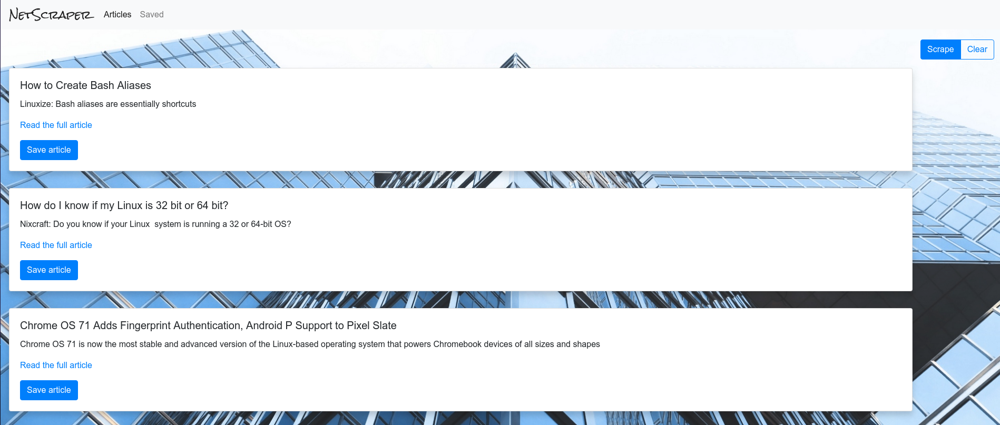
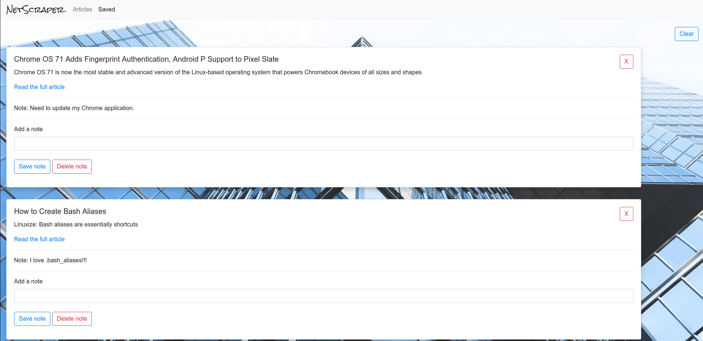

# NetScraper

#### Description
NetScraper is a scraping application. It scrapes news articels and allows the user to save and add a note to an article.

#### This application was built with the following technologies: 
Node,
MySQL,
Express,
Handlebars,
Mongoose,
Cheerio,
Morgan,
and Axios.

#### Screenshots

See it in action here on Heroku --> https://sleepy-earth-58939.herokuapp.com/